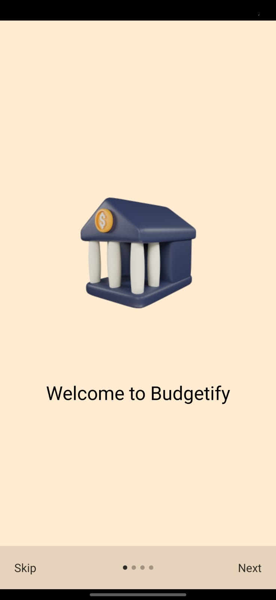
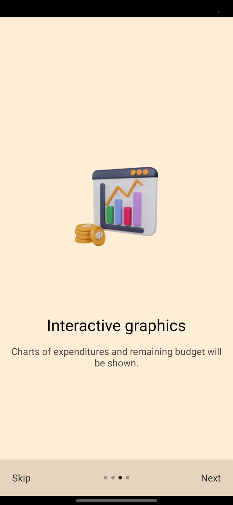
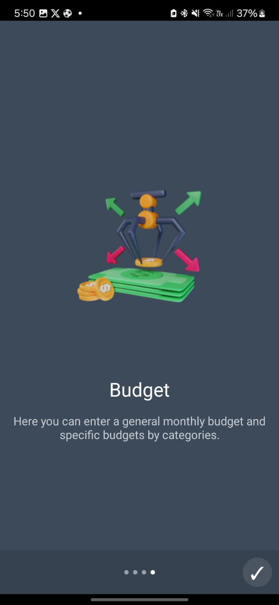
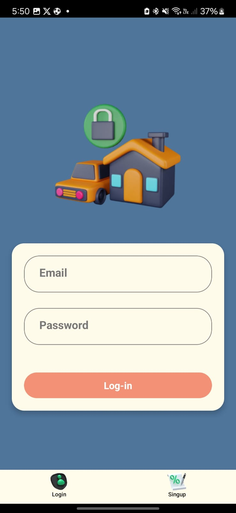
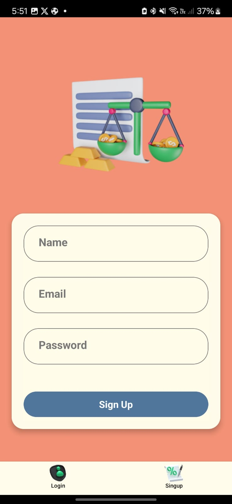
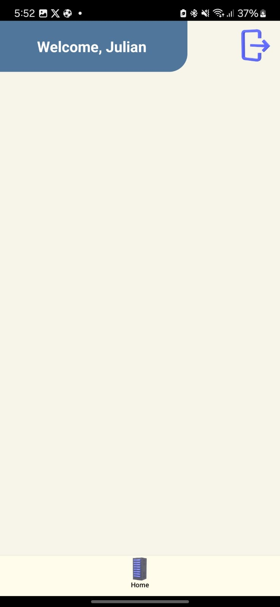

# Budgetify - Personal Finance Management App 📊

**Budgetify** is a React Native application designed to help users efficiently manage their personal finances. The app includes features such as user authentication, onboarding, permissions, and robust budget and transaction management.

---

## Features 🚀

### **1. Onboarding**
**Description**:  
When opening the app for the first time, users will see a series of introductory screens highlighting the main features of Budgetify.

**Logic**:  
Once completed, the onboarding screens will not appear again (state stored with **AsyncStorage**).

**Highlights**:
- App overview.
- Managing income, expenses, and budgets.
- Benefits of financial control.

---

### **2. Authentication (Login and Registration)**

**Login**:
- Users can log in by providing their **email** and **password**.
- Validates credentials and redirects to the main screen upon success.

**Registration**:
- Users can create a new account by providing:
  - **Full Name**
  - **Email Address**
  - **Password**
- Validates fields and detects already-registered emails.

---

### **3. Permissions**

**Storage**:
- Requests permissions to upload images from the gallery (useful for associating receipts or proof of transactions).

**Location (Optional)**:
- Requests permission to access the device's location (useful for logging locations associated with certain expenses).

---

### **4. Home (Main Screen)**
**Description**:  
The main screen provides an overview of the user's finances and a list of recent transactions.

**Features**:
- **Budget Overview**: Displays total income, total expenses, and available balance.
- **Recent Transactions List**: Shows transactions with basic details (date, description, category, amount).
- **Transaction Search**: Allows users to search for transactions by name, category, or amount.
- **Floating Button**: Quick access to add new transactions.

---

### **5. Transaction Management**

**Add Transaction**:
Users can add a new transaction with the following details:
- **Type**: Income or Expense.
- **Name/Description**.
- **Category** (e.g., Food, Transportation, Entertainment, etc.).
- **Date** (selectable).
- **Amount**.
- **Image** (optional, such as receipts or proof of payment).

**Edit Transaction**:
- Allows users to modify the details of an existing transaction.

**Delete Transaction**:
- Provides the option to remove a transaction from the list.

---

### **6. Budget Management**

**Add Budget**:
- Users can set a monthly budget or category-specific budgets (e.g., $200 for "Food").

**Visualization**:
- Visual indicators to show how much of the budget has been spent.


---

## Technologies Used 🛠️

- **React Native**: Main framework for app development.
- **AsyncStorage**: Local storage to manage app state (onboarding, preferences).
- **React Navigation**: For navigation between screens (Onboarding, Login, Home, etc.).

### **Additional Libraries**:
- Permissions Handling: **react-native-permissions**.
- Date Handling: **Luxon** or **Date-fns** (for date selection and formatting).
- Data Visualization: **Victory Native** or **react-native-chart-kit** (for income/expense graphs).

---

## Installation and Setup 🔧

### **1. Clone the repository**:
```bash
git clone https://github.com/yourusername/budgetify.git
```

### **2. Install dependencies**:
```bash
npm install
```

### **3. Configure necessary permissions**:
- **Android**: Edit `AndroidManifest.xml` to add storage and location permissions.
- **iOS**: Configure permissions in `Info.plist`.

### **4. Run the app**:
```bash
npm run android   
```

---

## App Screens 📸

1. **Onboarding**: Introduces the app's purpose and features.




2. **Login**: Login screen for existing users.


3. **SignUp**: Registration screen for new users.

4. **Home**: Dashboard showing financial overview and recent transactions.


---


